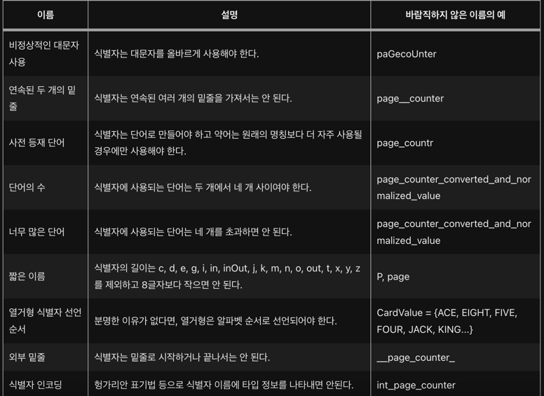
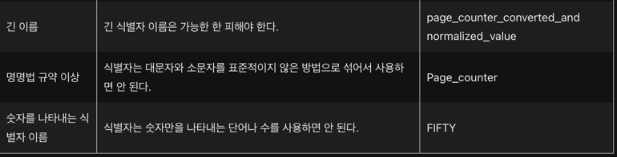

# 8장 명명을 잘하는 방법
## 8.1 이름이 중요한 이유
### 8.1.1 명명이 중요한 이유
- 이름은 코드베이스의 상당 부분을 차지한다
- 코드 리뷰에서 4건중 1건이 명칭과 관련된다. 그 만큼 자주 언급된다
- 이름은 문서화의 가장 쉬운 형태
  - 서로 다른장소에서 정보를 종합하는 것은 인지부하증가이다
  - 가장 많이 읽는 문서는 코드이다
- 이름이 표식역할을 할 수 있다
  - 변수 이름이 주석문 외에도 코드를 이해하는데 도움이 된다

### 8.1.2 명명에 대한 다양한 관점

### 8.1.3 초기 명명 관행은 지속적인 영향을 미친다
- 프로그램 개발 초기에 만들어진 식별자의 품질이 게속 유지된다
- 저장소에 새로 참여한 사람들은 프로젝트의 지침을 읽기보다는 기존 테스트를 보고 수정하는 경우가 많다.
- 최신 코드는 잘 따르는거 같지만 동일 코드베이스 내에서는 유지가 된다.(변경에 대한 부담)

## 8.2 명명의 인지적 측면
### 8.2.1 형식이 있는 이름은 STM을 돕는다
- 버틀러 : 문법적으로 비슷한 이름 처리시 인지부하가 낮다
- 알라마니스 : 코드베이스 내에서의 일관성은 청킹을 지원하여 이해하기 쉽다

### 8.2.2 명확한 이름이 LTM에 도움이 된다
- STM 은 크기가 제한되어 있으므로 단어별로 구분할 때 식별이 쉽다
- nmcntrlst vs name_counter_list
- 각 단어가 클래스의 도메인 개념을 사용할 때 LTM 에서 정보를 활용하기 쉽다

### 8.2.3 변수 이름을 이해에 도움이 되는 다양한 유형의 정보를 포함할 수 있다
1. 코드의 도메인에 대해 생각할 때 이름이 도움이 된다
   - costomer 은 제품도메인
2. 프로그래밍에 대해 생각할 때도 이름이 도움이 된다
   - tree, root node...
3. 경우에 따라 변수에 LTM 이 이미 알고 있는 규약에 대한 정보가 포함될수도 있다
   - j 는 안쪽 루프의 카운터

### 8.2.4 이름의 품질 평가 시기
- 문제 해결에 몰두할때 높은 인지 부하를 겪어 좋은 변수이름을 기억하기 어려울 수 있다
- 코딩 이외의 시간에 이름의 품질을 숙고하는 것이 바람직하다

## 8.3 어떤 종류의 이름이 더 이해하기 쉬운가?
### 8.3.1 축약할 것인가 하지 않을 것인가?
- 단어로 구성된 식별자가 이해하기 쉽지만 변수의 길이가 길어져 기억하기 어렵다(음절이 늘어나서)
- 코드를 이해하고 버그를 쉽게 찾기 위해서는 단어를 사용하고, 기억을 잘하기 위해서는 간결한 약자를 사용
- 이 둘 사이의 주의깊은 균형이 필요

#### 단일문자
- 단일문자는 특수한 경우가 아니면 거의 개발자마다 생각하는게 다르다
- 따라서 명명규약에 따르는게 바람직하다

### 8.3.2 스네이크 케이스냐, 캐멀 케이스냐
- 캐멀 케이스 쓸때 더 높은 정확도를 보인다
- 근데 찾는 시간이 좀더 걸리긴 했다(0.5초)
- 캐멀 케이스 짱짱맨

## 8.4 이름이 버그에 미치는 영향
### 8.4.1 나쁜 이름을 가진 코드에 버그가 더 많다
- 잘못된 명명방식은 읽기 어려운코드가 아니라 잘못된 코드일 가능성이 높다
- 코드베이스를 검사하여 잘못된 이름이 발생하는 위치를 찾아내는 일이 코드를 개선하고 버그 발생 가능성이 있는 위치를 찾는데 도움이 될 수 있다

## 8.5 더 나은 이름을 선택하는 방법
### 8.5.1 이름틀
- 단어 명명 시 개발자 마다 전부 다르다
- 따라서 이름틀을 만들면 좋다(max_benefit_num)
  - 변수 이름에서 단어의 순서가 다르면 인지부하가 늘어난다. 틀을 고정해 인지부하를 낮출수있다
  - 변수이름이 비슷하고 이름틀 사용시 LTM에서 관련정보를 쉽게 가지고 올 수 있따

### 8.5.2 더 나은 변수명에 대한 페이텔슨의 3단계 모델
1. 이름에 포함할 개념을 선택한다
2. 각 개념을 나타낼 단어를 선택한다
3. 이 단어들을 사용하여 이름을 구성한다

- 이름 선택 시 중요한 요소는 이름의 의도, 의도는 개체가 어떤 정보를 보유하고 있으며 무엇을 위해 사용되는지를 나타내는 것이다
- 이름에 개념을 포함하면 명명이 쉬워진다
- 개념을 포함해도 경쟁적인 옵션이 많을 수 있다
- 이런경우 프로젝트 어휘 사전(동의어)이 있으며 일관된 이름을 쓰는데 도움이 된다

### 결론
- 명명에서 중요한 것은 규칙이다
- 이름 틀로 단어 명칭의 양식을 정하고
- 프로젝트 어휘 사전으로 동의어를 통일하자
- 그리고 카멜케이스 짱짱맨
- 그리고 버틀러씨의 규칙 양식을 준수해라

